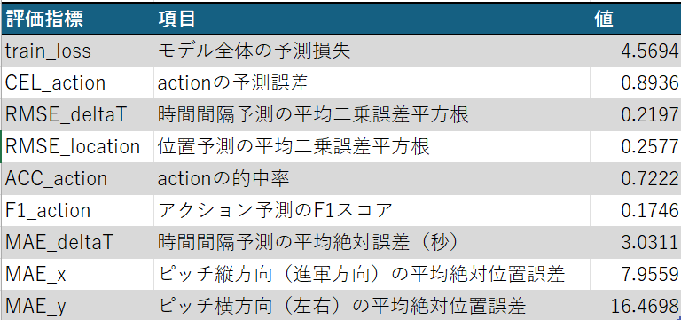
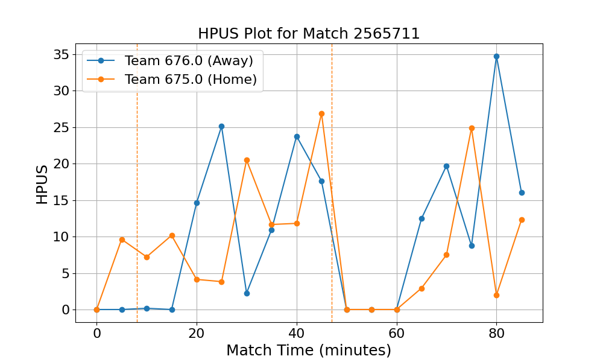
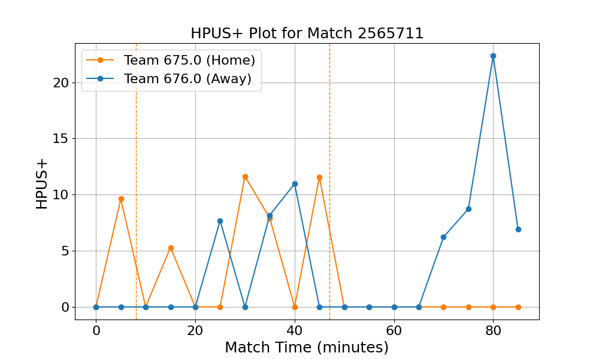

# 第4回課題

## 課題１
残したリーグ：La Liga (Spain)
また、欠損値がないことも確認した。

## 課題２・３
以下の試合を選択し、学習済みモデルを用いて推論を行った。
match_id : 2565711
レアル・マドリード（Home） vs バルセロナ(Away)【エル・クラシコ】
試合結果：０－３（バルセロナの勝利）
loss_dfは以下のとおりである。
**表１　loss_ds一覧**

## 課題４
各チームのポゼッションを評価するため、HPUS/HPUS+を可視化した。
### 図１　HPUSプロット

### 図2　HPUS+プロット

図1、図2及びロスの評価数値をもとに考察を行う。
**予測イベントvs実イベントの視覚的評価**
この試合では、バルセロナが54分、64分、90＋3分にそれぞれ点を決めている。
図を確認すると、60分経過前後からバルセロナのHPUS/HPUS+が高くなっており、試合結果との整合が確認できる。
また、ACC_actionが0.7222であり、イングランドのデータで学習されている既成モデルを用いても、高い精度でアクションの種類を予測できていることがわかる。

**HPUS/HPUS+についての考察**
HPUS.png を見ると、前半はお互いに高いスパイクを交互に作り合っており、一進一退の激しい攻防が繰り広げられていたことが読み取れる。

50分を過ぎたあたりから、レアル・マドリードのHPUS+の山は完全に消失し、ベースラインが0付近に張り付く状態が続いている。一方で、バルセロナは70分、80分と時間が進むにつれて非常に大きなスパイクを連続して発生させている。
特に HPUS_plus.png の80分付近に見られる最大のスパイクは、63分にレアルのカルバハル選手が退場となり数的優位に立ったバルセロナがレアル陣内を崩し、決定機を量産して試合を決定づけた後半の攻撃を検知している。

予測のずれが発生する局面の考察:
このように、退場や予期せぬハンドによるPK献上など、試合の構造が大きく変化した瞬間などでは、一時的にモデルの一般的な予測の裏をかくため、部分的な予測のはずれに繋がっていると考えられる。