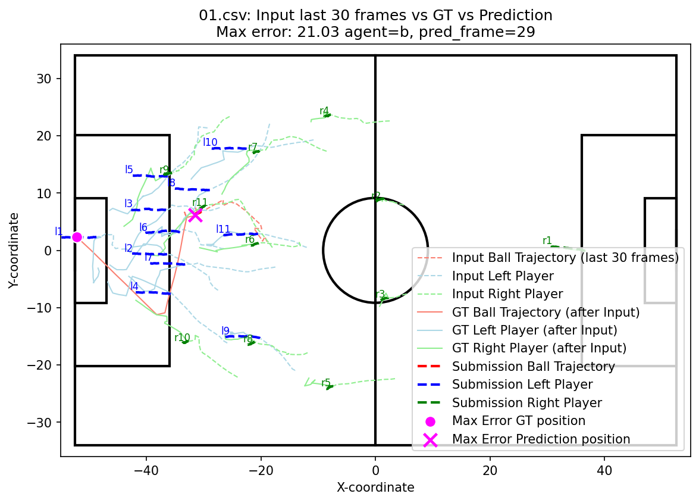
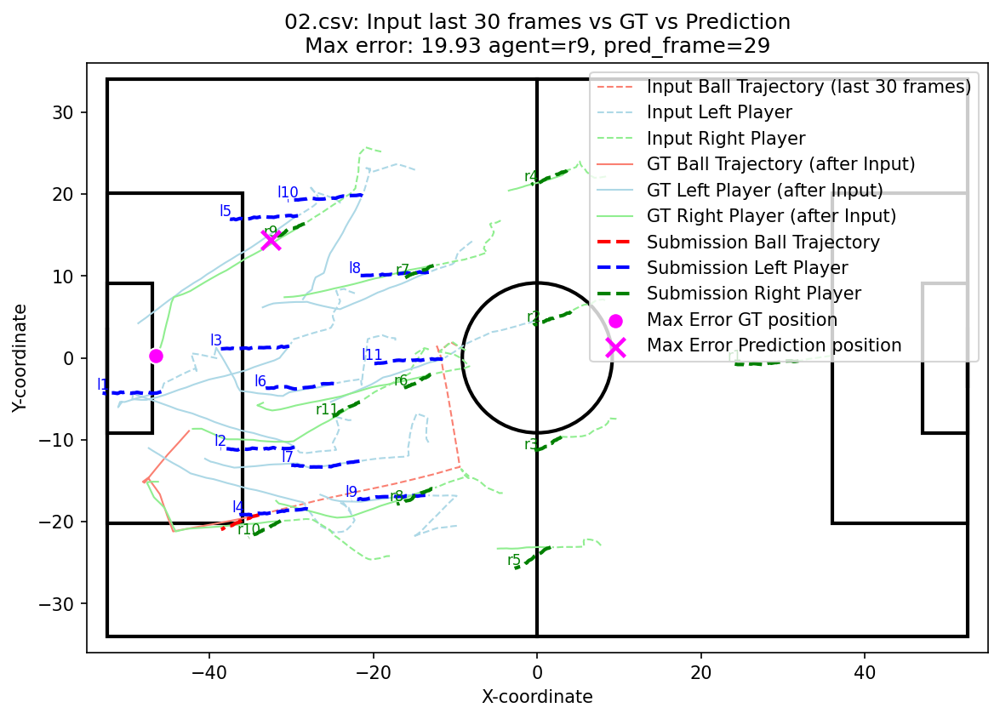
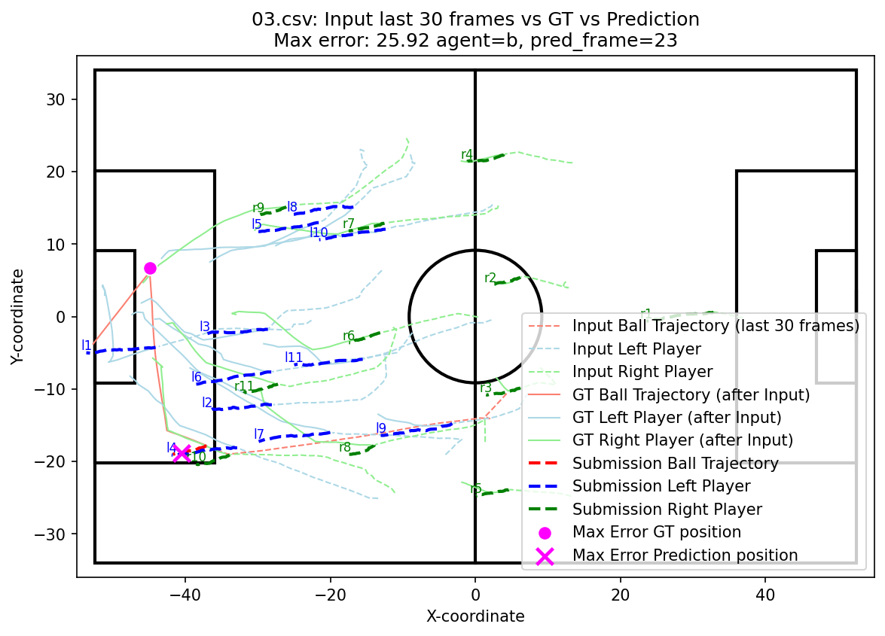
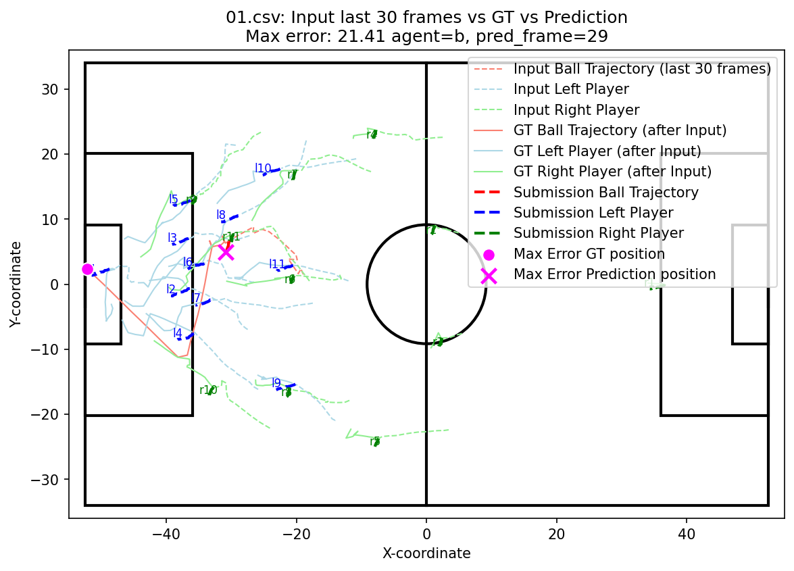

## 課題1：可視化・理解

### 可視化したファイル

本課題では、以下の3つのファイルについて、入力軌道、Ground Truth、予測軌道をピッチ上に重ねて可視化した。

- `01.csv`
- `02.csv`
- `03.csv`

各図では、入力軌道、Ground Truth、RNNによる予測軌道を以下のように区別して表示した。

- 入力軌道：細い破線
- Ground Truth：実線
- 予測軌道：太い破線
- ボール：赤
- 左チーム：青
- 右チーム：緑
- 最大誤差位置：ピンクの丸およびばつ印

---

### 入力軌道，GT，予測軌道の可視化

#### 01.csv

#### 02.csv

#### 03.csv

---

### ボールと選手の動きの特徴

今回のCSVでは、全体的に左チームのゴールに向かうような軌跡が多く見られた。予測軌道は、入力軌道の延長方向に沿った軌道がほとんどであった。

ボールの入力・GT軌道は、局所的には直線的が多いが、選手と接触する点では大きな方向転換が見られた。予測軌道は、GT軌道にくらべて移動が少なく、すべて直線的な軌道となっている。

一方、選手の動きは入力・GT軌道は、ボールの動きに比べて方向転換は緩やかであるが、常に複雑に曲がりながら移動している。予測軌道はほとんど直線的で、左チームの移動量が右チームの移動量よりも大きい傾向がみられた。

### ボール・左チーム・右チーム別の平均誤差

GTと予測軌道のユークリッド距離を用いて、各csvファイルにおけるボール、左チーム、右チームのRMSEを計算した。
各ファイルで最も誤差が小さいものを太字で示す。

| file | group | RMSE |
|---|---|---|
| 01 | ball | 10.693768 |
| 01 | left | 3.145020 |
| 01 | right | **3.117657** |
| 02 | ball | 8.055549 |
| 02 | left | **5.682958** |
| 02 | right | 6.488649 |
| 03 | ball | 13.830927 |
| 03 | left | **5.564426** |
| 03 | right | 6.109322 |

### 最も予測が外れている箇所と，その理由の考察

#### 各ファイルの最も誤差が大きい箇所

各ファイルにおいて、最も誤差が大きい箇所のグループ、フレーム番号、RMSEなどを以下に示す。
agentについては、bがボール、r9が右チームの選手を表す。

| file | agent | group | frame | RMSE |
|---|---|---|---|---|
| 01 | b | ball | 29 | 21.03 |
| 02 | r9 | right | 29 | **19.93** |
| 03 | b | ball | 23 | 25.92 |

#### 予測が外れている理由の考察
上記平均誤差の結果から、いずれのファイルにおいても、ボールの予測誤差が選手の予測誤差よりも大きいことがわかる。特に、`01.csv`と`03.csv`のボールの誤差は選手の誤差に対して非常に大きくなっている。
実際、この２つのファイルで誤差が最大になっているのは、最終フレーム付近のボールである。
これは、GTにおけるボールの最終位置が予測軌道から大きく離れていることや、パスやシュートなどのボールの急激な方向転換が予測困難であることによるものであると考えられる。
`02.csv`については、GTの軌道が途中まで直線で予測軌道と大きくは乖離しておらず、また方向転換後もGT軌道が入力軌道から大きく離れていないため、ボールの誤差は小さくなっていると考えられる。
一方で、r9の選手のGT軌道はほぼ直線的に大きく移動しているため、予測軌道との乖離が大きくなり、誤差が最大となったと推察できる。

## 課題2：特徴量・入力条件の変更

### 変更した内容

本課題では、予測フレーム長を30フレームに固定した上で、入力フレーム数 `burn_in` と予測対象フレーム数 `t_step` を変更した。  
具体的には、元設定である `burn_in=30, t_step=60` を baseline とし、以下の2条件と比較した。
- short input: `burn_in=20, t_step=50` 
- long input: `burn_in=40, t_step=70`

これによって、入力フレーム数による予測精度の違いを比較する。

### 変更前後の予測軌道の図

ここでは、`01.csv` について、baseline と変更条件の予測軌道を比較する。

#### baseline: `burn_in=30, t_step=60`

#### short input: `burn_in=20, t_step=50`

#### long input: `burn_in=40, t_step=70`

ボールの予測軌跡については、大きな違いは見られなかった。一方で、選手の予測軌跡については違いがみられた。左チームの予測軌跡は、baselineは左に、short inputはやや左下に、long inputはやや左上にそれぞれ移動している。右チームの予測軌跡は、baselineは左下方向に少し伸びていたのに対し、short inputはほとんどその場にとどまるような軌跡となっていた。long inputは、baselineとほとんど同様の軌跡となっている。

### 評価値の比較

#### ファイル・グループ別のRMSE

各入力条件に対し、課題1と同様に、GTと予測軌道のユークリッド距離を用いて、各csvファイルにおけるボール、左チーム、右チームのRMSEを計算した。
各行において、最も誤差が小さいものを太字で示す。

| file | group | baseline | short input | long input |
|---|---|---:|---:|---:|
| 01 | ball | 10.693768 | 10.546617 | **10.375220** |
| 01 | left | **3.145020** | 4.105169 | 3.830979 |
| 01 | right | 3.117657 | 3.176229 | **2.834171** |
| 02 | ball | 8.055549 | 8.172742 | **7.041096** |
| 02 | left | **5.682958** | 6.319048 | 6.683888 |
| 02 | right | 6.488649 | 6.215663 | **5.846497** |
| 03 | ball | 13.830927 | 13.848021 | **13.388376** |
| 03 | left | **5.564426** | 5.787441 | 5.800232 |
| 03 | right | 6.109322 | 5.945975 | **5.563372** |

### 改善または悪化した理由の考察

ボールと右チームの軌道予測は、 `01.csv`, `02.csv`, `03.csv` のすべてで long input が最小誤差となった。これは、左向きに進行するボールや右チームの軌道は、「どこから来たのか」といった情報が重要であり、入力フレーム数が多い方がより正確に予測できることを示していると考えられる。
一方、左チームの軌道予測は、 `01.csv`, `02.csv`, `03.csv` のすべてで baseline が最小誤差となった。これらのファイルにおいて、左チームは自陣内での複雑な守備行動が多く、逆に古い情報がノイズのようになってしまうことが予測精度を下げる要因となったのではないかと予想した。ただ short input よりも baseline の方が誤差が小さいことから、入力フレーム数が少なすぎるのも予測精度を下げる要因となることがわかる。

