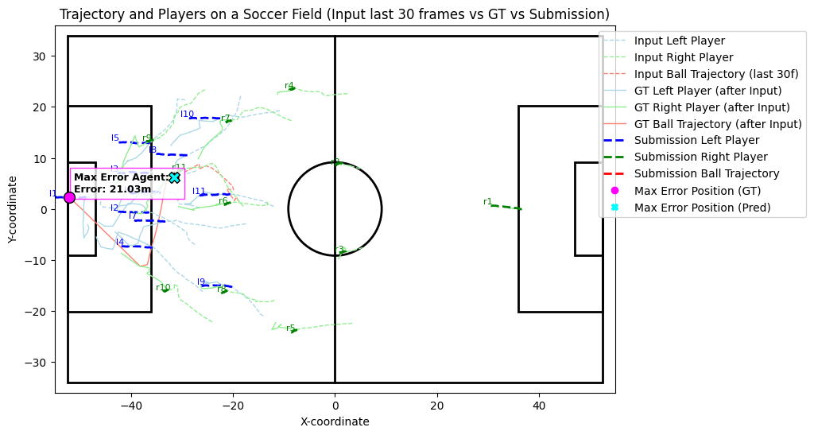
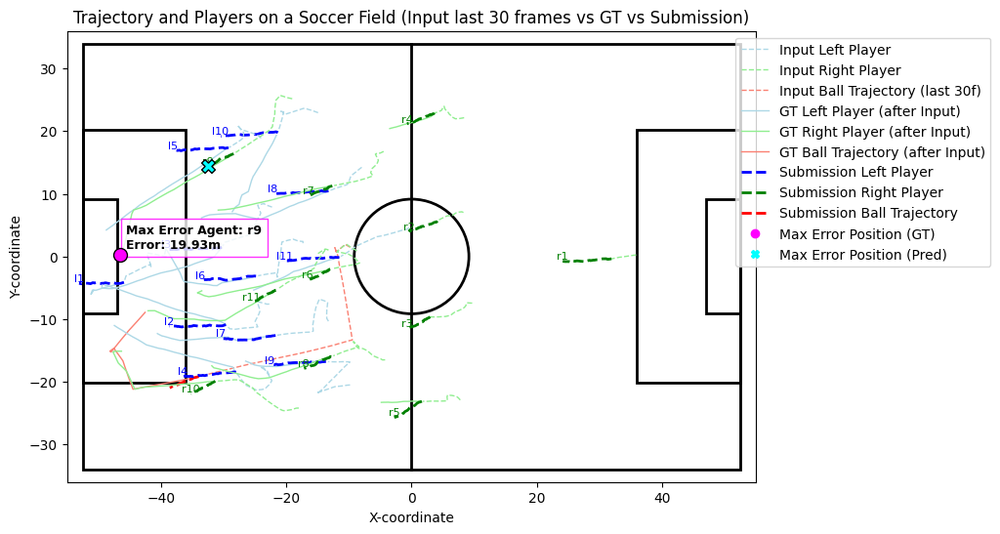
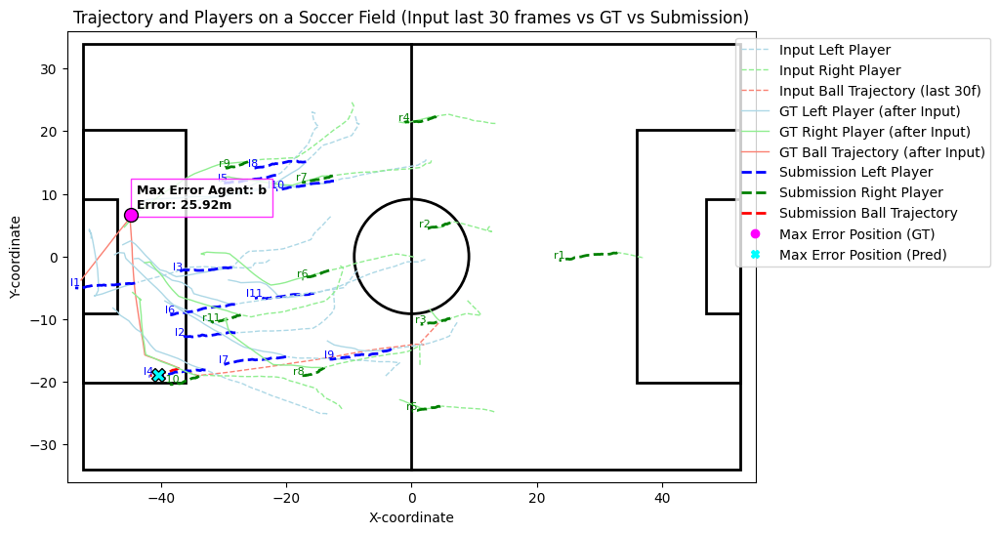
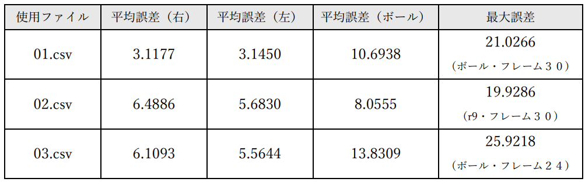
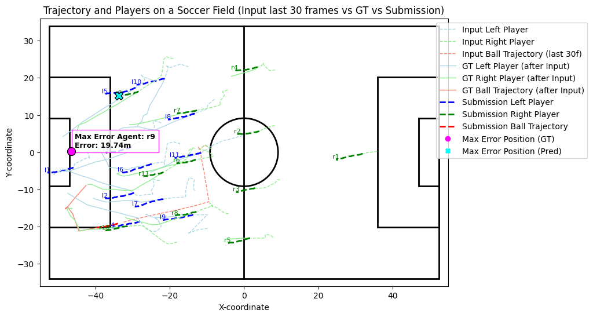
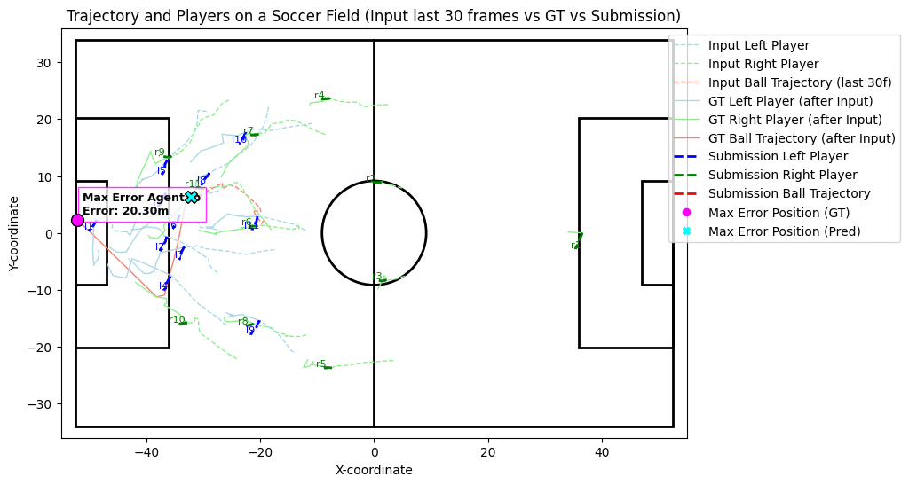
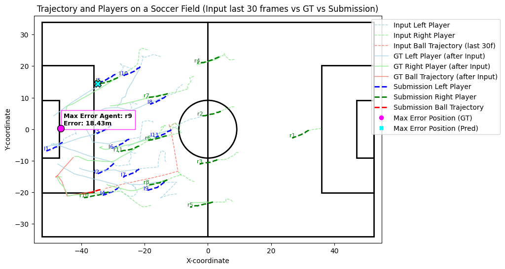
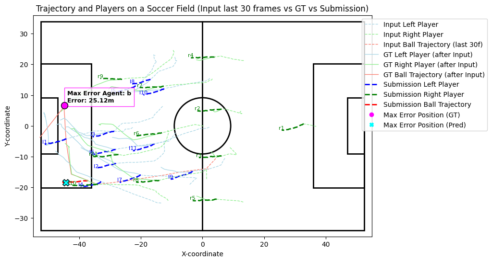
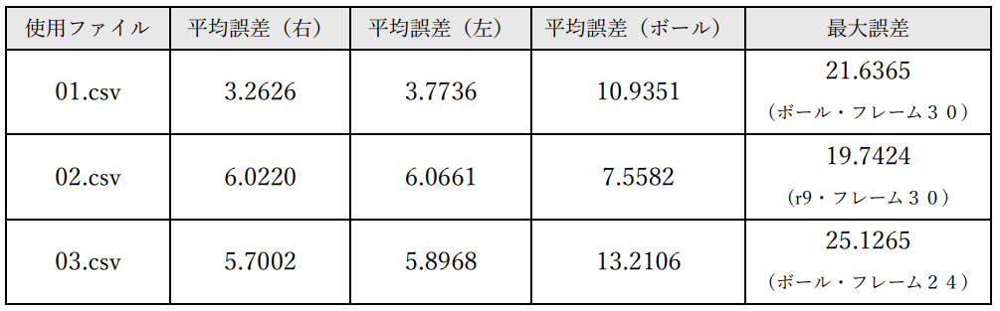
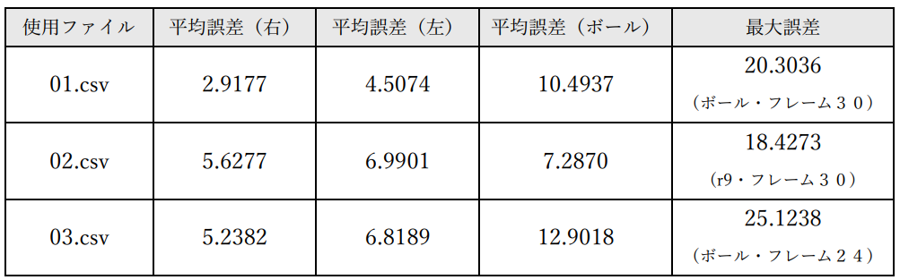

# Soccer Trajectory Prediction Challenge 2025 のデータを用いたサッカーにおける選手とボールの将来軌道を予測

## 課題１：可視化・理解
可視化した画像をいかに示す。

**ボールの動き**
3画像とも、ボールのGTは直線的な動きに加えて、途中で急激に方向を変えたり曲線を描いたりしている。
これは選手との接触やパス、シュートによるものだと考えられる。
一方でモデルの予測は部分的で短い直線の軌道として見られる。このことから、ボールの方向転換や加速度を、RNNベースラインでは捉えるのが難しいということがわかる。

**選手の動き**
GT軌道を見ると、ボールに比べて急激な方向転換は少なくなめらかな曲線で動いている。また、ボールや相手の動きに連同しながら、チーム全体的に同じ方向へ移動している。
予測の多くは直線的な破線で示されており、入力時点での速度・方向のまま、移動距離が平均に収束して短くなるような傾向がある。

**誤差に関する考察**
誤差は以下のようになった。

各オブジェクトにおける平均誤差はMAEで算出した。左チーム全体の平均誤差は1.52m、右チーム全体の平均誤差は1.38mであるのに対し、ボールの平均誤差は12.45mであり、選手に比べてボールの予測精度が劣っていることがわかる。また、３つのファイルのうち01と03では最大誤差が起きたオブジェクトがボールであり、フレームは３０、２４フレーム目であった。このことから、予測時間が経過するにつれて誤差が大きくなり、特にボールに対する予測性能が悪化していることが示唆される。02.csvのボール予測については、GTと予測の軌道で大きな差がないため、そこまで大きな誤差が生じなかったことが考えられる。

## 課題２：特徴量・入力条件の変更
**変更内容**
入力フレーム数と予測対象フレーム数を、（３０，６０）から（２０，５０）、（１０，４０）に変更して実験した。

**予測軌道の図**
画像を以下に示す。

入力フレーム数が減少するにつれて、モデルが時系列データから選手特有のなめらかな軌道やボールの方向転換を予測するのが困難になり、出力される予測軌道は単純で直線的な並行移動の軌道へと変化した。ボール軌道の予測については、例えば03.csvに着目すると、何らかの理由によるボールの急激な方向転換（GT）に対しての予測軌道のずれが徐々に大きくなっている。また、選手についても、GTではそれぞれの選手がそれぞれの方向へ動いているのに対して、予測軌道はすべての選手がほとんど同じ方向、同じ距離へ並行に移動している。このことから、参照できる時系列の長さの喪失が予測軌道の正確さに大きな影響を与えていることがわかる。

**評価値の比較**
それぞれの平均誤差、最大誤差をいかに示す。

**考察**
上に示した表をもとに評価を行う。
10フレーム予測について、予測軌道の精度に反して、左チーム以外の誤差が小さくなってしまっていることがわかる。考えられる原因は、予測するフレームが時系列データにおいて手前のほうになっていることである。GTの、ボールの急な方向転換やそれに伴う選手の軌道の曲線化が起きる前の部分が予測対象となったため、直前の慣性にのみ依存した単純な予測でも誤差が小さくなってしまったと考えられる。
20フレーム予測についても、10フレーム予測ほどではないが誤差が小さくなっている部分があり、同じ理由が考えられる。一方で、30フレームよりも誤差が大きくなっている部分もあり、入力フレーム数が予測精度を下げていることも十分可能性として考えられる結果となった。
最大誤差についてはいずれも対象は同じであり、フレーム後半に行くにつれて予測が困難になること、ボールの予測の精度は低くなってしまうことがわかる。